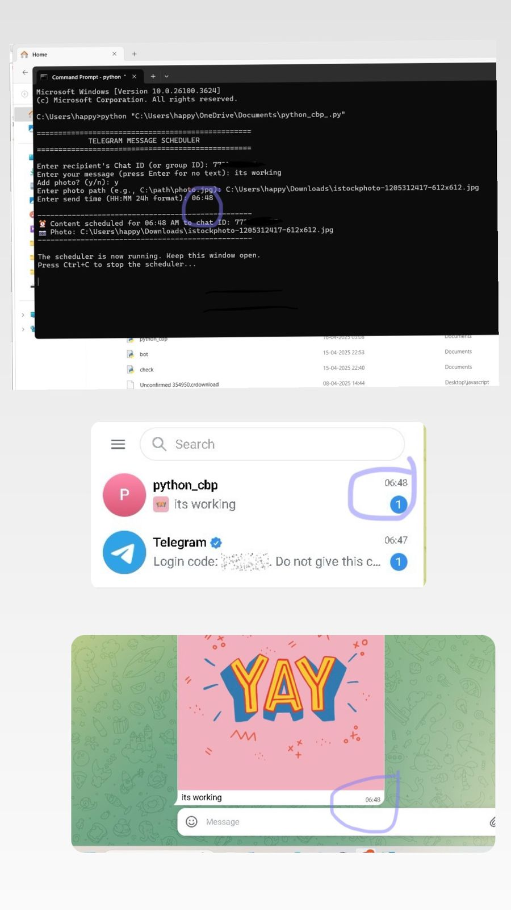

# Telegram-Auto-Message-Sender
Python bot to schedule Telegram messages
# Telegram Auto Message Scheduler 🤖⏰



A Python bot to **schedule and automate** Telegram messages with:
- Text + photo attachments
- Custom timing (instant or future)
- Robust error handling

## ✨ Features
✅ Schedule messages to individuals/groups  
✅ Attach photos with captions  
✅ Real-time error notifications (blocked bots, invalid files)  
✅ Simple CLI interface with input validation  

## 🛠️ Tech Stack
- Python 3.8+
- [python-telegram-bot](https://python-telegram-bot.org/) (v20.3)
- APScheduler for cron jobs

## 🚀 Quick Start

### Prerequisites
- Python 3.8+ installed
- Telegram bot token from [@BotFather](https://t.me/BotFather)

### Installation
1. Clone the repo:
   ```bash
   git clone https://github.com/your-username/Telegram-Auto-Message-Sender.git
   cd Telegram-Auto-Message-Sender
2. Install dependencies:
   ```bash
   pip install -r requirements.txt
3. Create .env file (never commit this):
   ```bash
   echo "BOT_TOKEN=your_token_here" > .env
### Usage
1. Get your Chat ID:
   ```bash
   python get_chat_id.py

   (Send any message to your bot - ID will print in console)
2. Schedule messages:
   ```bash
   python python_telegram_scheduler.py
Follow the CLI prompts to:
- Enter Chat ID
- Add text/photo
- Set schedule time (HH:MM or "now")
